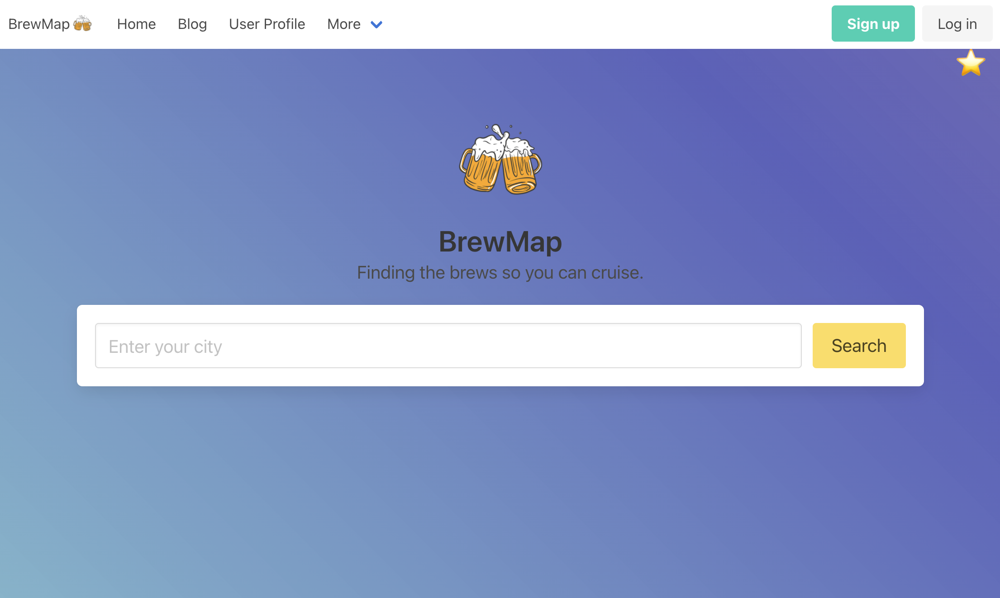
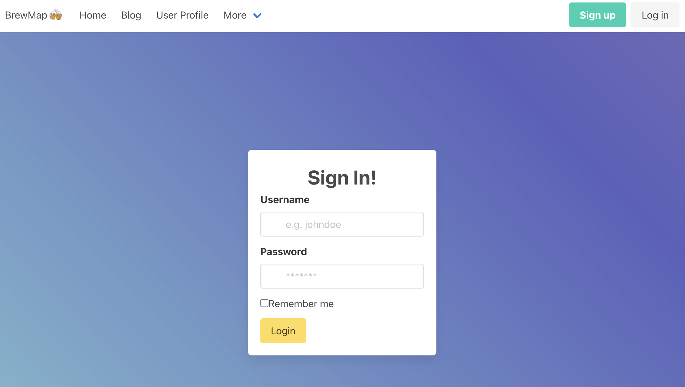
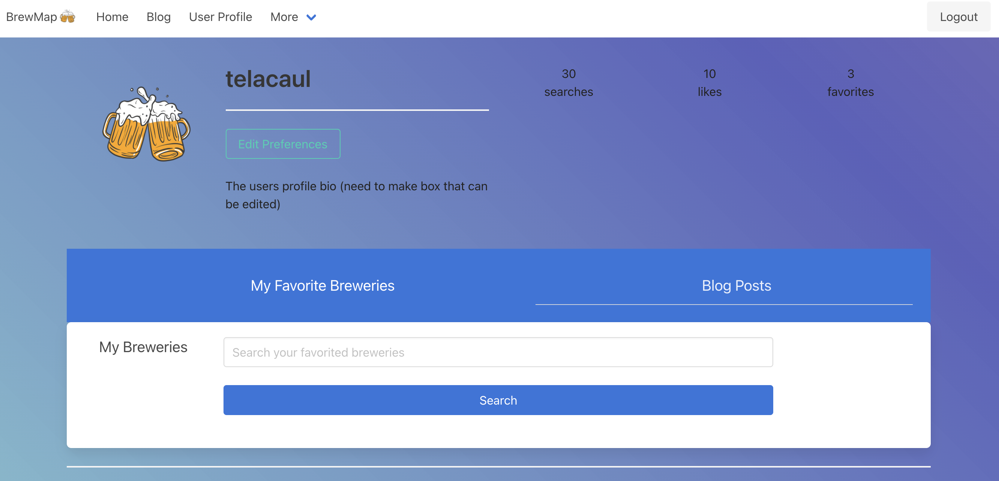
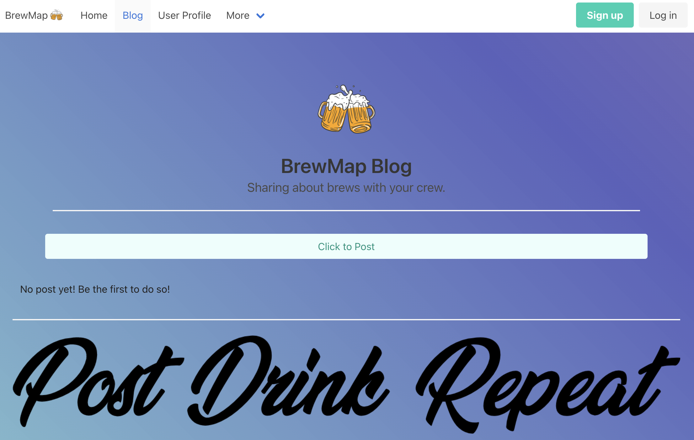

# BrewMap 3.0
## Decription
The pandemic is finally over, your friends are all vaccinated and it’s time to grab some drinks at your local pubs. Just one brewery isn’t going to cut it - you want to do a full pubcrawl to celebrate the momentous occasion. What is close by? Where should we go first, second, third?

BrewMap is here to help! 

With our updated changes to BrewMap 3.0, you can login and share your experiences or explore other pubcrawl adventures on our community blog so you’re always connected with other pub-crawlers.

## Technologies Used
* React front-end
* GraphQL with Node.js and Express.js server
* MongoDB and Mongoose ODM for database
* Queries and mutations for retrieving, adding, updating and deleting data
* Includes authetication (JWT)
* Protected API key information on the server 
* Deployed to Heroku

## Screenshots

## Deployment Link
[Visit our deployed project here](https://brewmap3.herokuapp.com/login)

## Contributors
[Rich Brian Santos](https://github.com/rbsantos-code)
[Jennifer Nguyen](https://github.com/njthanhtrang)
[Ian Osborne](https://github.com/riosborne6)
[Felicia Harris-Foster](https://github.com/harrisfd)
[Tela Caul](https://github.com/telacaul)
